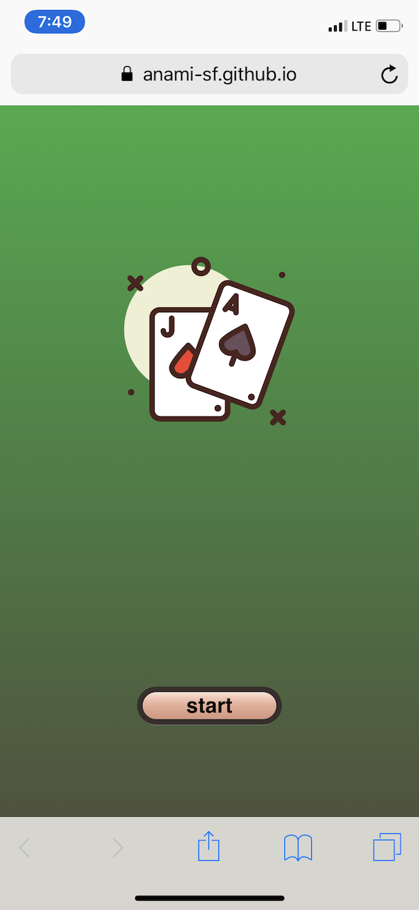
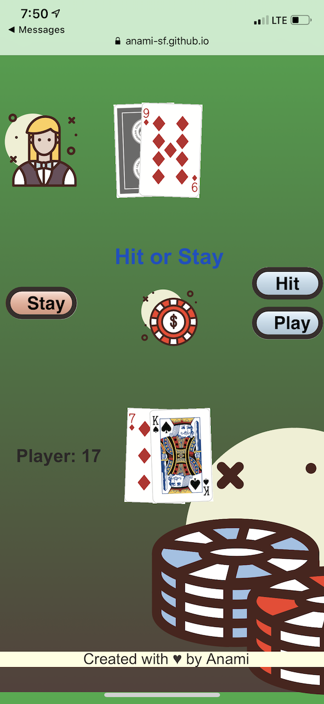
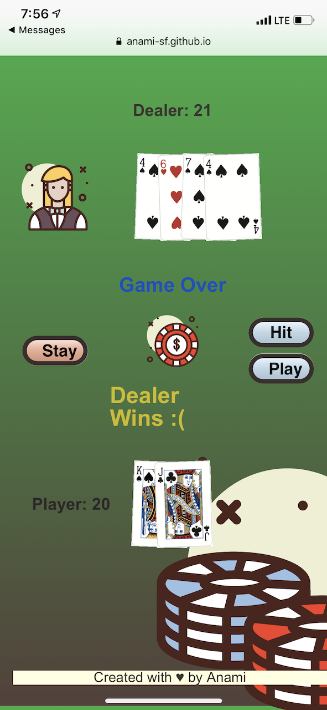

# Blackjack

Blackjack is the American variant of a globally popular banking game known as Twenty-One, whose relatives include Pontoon and Vingt-et-Un. It is a comparing card game between one or more players and a dealer, where each player in turn competes against the dealer. Players do not compete against each other. It is played with one or more decks of 52 cards, and is the most widely played casino banking game in the world.[2]:342 The objective of the game is to beat the dealer in one of the following ways:

    1.Get 21 points on the player's first two cards (called a "blackjack" or "natural"), without a dealer blackjack;

    2.Reach a final score higher than the dealer without exceeding 21; or

    3.Let the dealer draw additional cards until their hand exceeds 21 ("busted").  

> [**How to Play Blackjack**](https://en.wikipedia.org/wiki/Blackjack)

## Technologies Used

* HTML
* CSS
* Javascript
* jQuery

## Getting Started

* Click 'start' in the home page
* Clit 'play' to deal the first hand
* Click 'hit' to get another card
* Click 'stay' when you no longer want more cards
> [**Play Blackjack**](https://anami-sf.github.io/blackjack-v2/game.html)

## Screenshots

## Planned Improvements

* Allow betting and add money
* Add dobule-down function
* Add insurance function
* Add sound when dealing cards

## Pseudo Code

### HTML layout will include  

    **Buttons will be true or false  
    Deal Button
    Hit Button
    Stand Button
    Reset putton
    Display dear + Player's hand
    Display Game status
    Display winner

### Initialize  

    Render game table:
         Deal two cards each to player and dealer
            Player cards: both face up
            Dealer cards: one face up and one fac down

### Game  

    If (!standButton && playerHand <= 21 & dealerHand <= 17 ) {
        If hit:
            Pop a card from the deck
            Add popped card to the playerHand 
        If stand: 
            while (dealerHand < 17) {
                Pop a card from the deck
                Add popped card to the dealerHand 
            }      
    } else {
        call Win function 
    }

### Win  

    if (playerHand === 21 || (playerHand < 21 && playerHand > dealerHand)){
        Player Wins
    } else {
        Dealer Wins
    }

### Dealer Object  

    Array of cards to keep track of cards dealt to dealer  
    Total sum of card values

### Player Object  

    Array of cards to keep track of cards dealt to

### Card Object  

    Object to hold:
        Suite, value, color
        Card html image  
