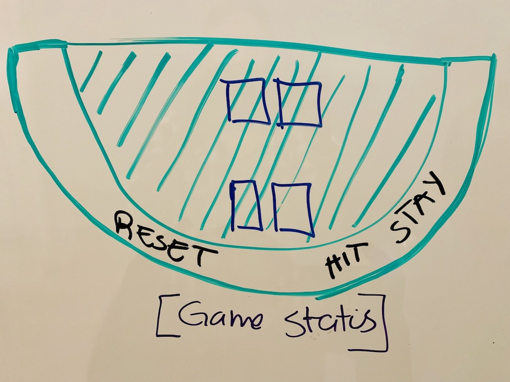

# Blackjack

[How to Play Blackjack](https://en.wikipedia.org/wiki/Blackjack)

## Create state for  

## HTML layout will include  

    **Buttons will be true or false  
    Deal Button
    Hit Button
    Stand Button
    Reset putton
    Display dear + Player's hand
    Display Game status
    Display winner

## Initialize  

    Render game table:
         Deal two cards each to player and dealer
            Player cards: both face up
            Dealer cards: one face up and one fac down

## Game  

    If (!standButton && playerHand <= 21 & dealerHand <= 17 ) {
        If hit:
            Pop a card from the deck
            Add popped card to the playerHand 
        If stand: 
            while (dealerHand < 17) {
                Pop a card from the deck
                Add popped card to the dealerHand 
            }      
    } else {
        call Win function 
    }

## Win  

    if (playerHand === 21 || (playerHand < 21 && playerHand > dealerHand)){
        Player Wins
    } else {
        Dealer Wins
    }

## Dealer Object  

    Array of cards to keep track of cards dealt to dealer  
    Total sum of card values

## Player Object  

    Array of cards to keep track of cards dealt to

## Card Object  

    Object to hold:
        Suite, value, color
        Card html image  
